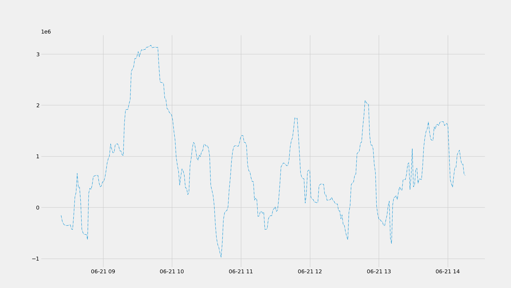

<!-- PROJECT LOGO -->
<br />
<p align="center"> 
  <h3 align="center">Bitmex Bot</h3>
  <h5 align="center">Built in 2020 June </h5>

  <p align="center">
    Trading bot that places different order types automaticaly based on a strategy
  </p>
</p>


<!-- TABLE OF CONTENTS -->
<details open="open">
  <summary>Table of Contents</summary>
  <ol>
    <li>
      <a href="#about-the-project">About The Project</a>
      <ul>
        <li><a href="#built-with">Built With</a></li>
      </ul>
    </li>
    <li>
      <a href="#getting-started">Getting Started</a>
      <ul>
        <li><a href="#installation">Installation</a></li>
      </ul>
    </li>
    <li><a href="#license">License</a></li>
    <li><a href="#contact">Contact</a></li>
  </ol>
</details>


<!-- ABOUT THE PROJECT -->
## About The Project

<h5 align="center"> Plot of OBV from last 900 candles </h5>


Built as an initial idea to reduce the human factor from any trading strategy. The bot currently has 3 types of indicators, a WMA, an HMA, and an OBV, manipulating data in different ways to achieve its goal. Any of the strategies there are written have NOT been backtested and I believe that they will have negative returns.
The purpose of the project was to test automatic trading, but the conclusion was that we need a better understanding of the market.
Supports all types of order types [Limit, Market, Stop market, etc]

### Built With

* Python
<!-- GETTING STARTED -->

### Packages
* bitmex
* numpy
* pandas
* matplotlib

## Getting Started

### Installation

1. Clone the repo
   ```sh
   git clone https://github.com/sergane13/Bitmex-Bot
   ```
2. Open project in Pycharm or any other IDE

3. Replace credentials with yours
   ```sh
    keys.py
    keys_testnet.py
   ```

4. Run bot.py

5. Wait a few secconds for program to run and then you will see the plot

<!-- CONTRIBUTING -->
## Project structure

```bash
< PROJECT ROOT >
   |
   |-- BitmexBot.py
   |-- bot.py
   |-- DataProcesser.py
   |-- keys.py
   |-- keys_testnet.py
   |-- liveplot.py
   |-- OBV_vals
   |-- Readme                            
```

<!-- LICENSE -->
## License

Project Template adapted from [Othneil Drew](https://github.com/othneildrew) / [Best-README-Template](https://github.com/othneildrew/Best-README-Template).


<!-- MARKDOWN LINKS & IMAGES -->
<!-- https://www.markdownguide.org/basic-syntax/#reference-style-links -->
[product-screenshot]: images/screenshot.png


## Contact
* You can find me on discord : Serban#0756
* Project is open source for any kind of use as long as you keep the initial creator